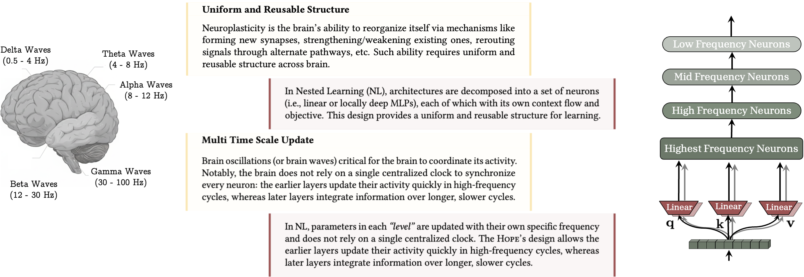
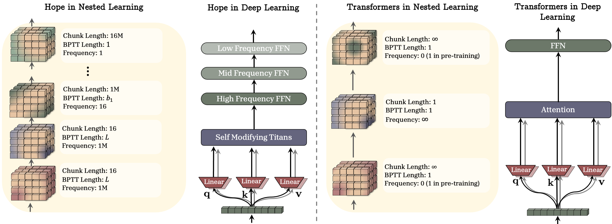
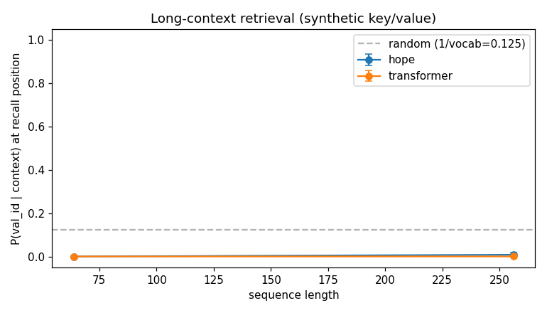
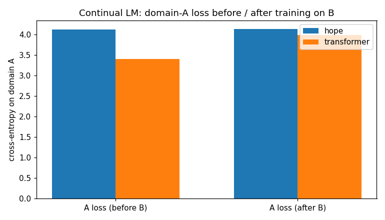
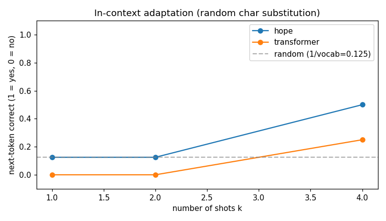

# HOPE-tensorflow

<p align="center">
  
  <br/>
  <em>Figure 1 of the paper: the brain's uniform / reusable structure and multi-time-scale updates motivate Nested Learning.</em>
</p>

A tensorflow implementation of *Nested Learning: The Illusion of Deep Learning Architectures* (Behrouz, Razaviyayn, Zhong, Mirrokni; Google Research; NeurIPS 2025). [arXiv:2512.24695](https://arxiv.org/abs/2512.24695)

> Status: **All six phases done.** Repo holds runnable HOPE + parameter-matched MiniTransformer + three head-to-head benchmark scenarios + seven walkthrough notebooks.

> Local working directory is `hope-architecture/`; published repo and importable package are `HOPE-tensorflow` / `hope`.

---

## Why this repo

<p align="center">
  
  <br/>
  <em>Figure 5 of the paper: HOPE's Self-Modifying Titans → multi-frequency FFN stack vs the standard Transformer Attention → FFN stack. This repo implements the left-hand side.</em>
</p>

HOPE pairs the *Nested Learning* paradigm with a recurrent backbone: a self-modifying layer plus a **Continuum Memory System (CMS)** that updates memory banks at multiple frequencies. PyTorch reimplementations exist; this repo fills the TF / Keras gap and doubles as a study log.

Every component in `hope/` cites the corresponding paper equation / section number in its docstring. Notebook 01 maps each paper concept to a file.

---

## Install

```bash
git clone https://github.com/rlaope/HOPE-tensorflow.git
cd HOPE-tensorflow
python -m venv .venv && source .venv/bin/activate
pip install -e ".[dev]"
bash scripts/download_paper.sh        # arXiv 2512.24695 → papers/
python scripts/download_data.py       # TinyShakespeare → data/
```

Tested with Python 3.12 and TensorFlow 2.20. Should work on any TF ≥ 2.15 / Python ≥ 3.10.

---

## Quickstart

```python
import tensorflow as tf
from hope.model import HOPE
from hope.baseline import MiniTransformer

hope = HOPE(
    vocab_size=65,
    d_model=32,
    n_self_mod_layers=1,
    cms_banks=(1, 4),
    cms_decays=(0.01, 0.005),
    n_heads=2,
    max_seq_len=64,
)

# A MiniTransformer with the same parameter budget (+/- 5%):
baseline = MiniTransformer.matched_to(hope, tolerance=0.05)

x = tf.constant([[1, 2, 3, 4]], dtype=tf.int32)
print(hope(x).shape, baseline(x).shape)   # both (1, 4, 65)
```

---

## Train

```bash
python scripts/train.py --model hope        --dataset tinyshakespeare \
    --steps 200 --seq-len 64 --batch-size 8 --d-model 64 --n-layers 1

python scripts/train.py --model transformer --dataset tinyshakespeare \
    --steps 200 --seq-len 64 --batch-size 8 --d-model 64 --n-layers 2
```

Both branches share the same Adam loop and print the parameter count at init, so the two models can be compared head-to-head on equal compute.

---

## Benchmark — HOPE vs MiniTransformer

```bash
python scripts/benchmark.py --scenario all --steps 50 --seq-len 64 --batch-size 4
```

Three scenarios, each emitting a PNG into `assets/`:

### Long-context retrieval

A `(key, value)` pair planted at the start of the sequence, recall queried near the end. CMS's claim is that long-range information survives.



### Continual LM (catastrophic forgetting)

Train on TinyShakespeare (domain A), then on random alphabet sequences (domain B), then re-measure cross-entropy on A. Smaller before-vs-after gap = less forgetting.



### In-context adaptation

`k` examples of a random character substitution in the prompt; ask the model to apply the same substitution to a query. Self-modifying-layer signal.



These plots use tiny models and tiny training budgets — the *shape* of the comparison is the takeaway, not the absolute numbers.

---

## Notebooks

| # | Topic |
|---|---|
| 01 | Paper overview + map of paper concepts to repo modules |
| 02 | `AssociativeMemory` (Hebbian / Delta / Oja) |
| 03 | `ContinuumMemorySystem` (multi-frequency banks) |
| 04 | `SelfModifyingLayer` (per-token fast weight) |
| 05 | Full `HOPE` model + a training loop |
| 06 | Long-context retrieval scenario |
| 07 | Continual LM forgetting scenario |

Run them all in one shot:

```bash
jupyter nbconvert --to notebook --execute --inplace notebooks/*.ipynb
```

---

## Roadmap

| Phase | What | Status |
|---|---|---|
| 0 | Repo scaffolding, paper downloader, first push | done |
| 1 | `AssociativeMemory`, `SelfModifyingLayer` + tests | done |
| 2 | `ContinuumMemorySystem` + visualization notebooks | done |
| 3 | `HOPE` model assembly (LM head included) | done |
| 4 | `MiniTransformer` baseline + `DGD` / `DeepOptimizer` + `scripts/train.py` + char-level loaders | done |
| 5 | Three-scenario benchmark + assets/*.png | done |
| 6 | Documentation polish, notebook 01, final push | done |

---

## Hardware

Single GPU. Minimum Colab T4 / 8 GB+ local VRAM recommended. The repo also runs on CPU for smoke tests (`pytest -v` exercises a CPU-only path).

`hope-tensorflow` deliberately stays at nanoGPT scale (a few million to tens of millions of parameters). No multi-GPU, no XLA tricks, no custom CUDA, no LLM-scale training.

---

## Paper

Behrouz, A., Razaviyayn, M., Zhong, P., Mirrokni, V.
*Nested Learning: The Illusion of Deep Learning Architectures.* NeurIPS 2025.

[arXiv:2512.24695](https://arxiv.org/abs/2512.24695) — [Blog](https://research.google/blog/introducing-nested-learning-a-new-ml-paradigm-for-continual-learning/) — local PDF: `bash scripts/download_paper.sh`

```bibtex
@inproceedings{Behrouz2025NestedLearning,
  title     = {Nested Learning: The Illusion of Deep Learning Architectures},
  author    = {Behrouz, Ali and Razaviyayn, Meisam and Zhong, Peilin and Mirrokni, Vahab},
  booktitle = {Advances in Neural Information Processing Systems},
  year      = {2025},
  url       = {https://arxiv.org/abs/2512.24695}
}
```

---

## License

MIT. See [LICENSE](LICENSE).
